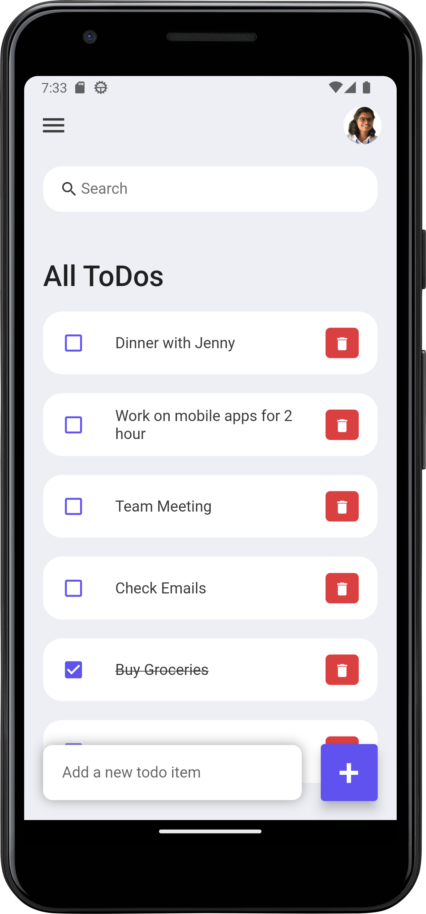

# Flutter ToDo App

A basic to-do app built with Flutter that offers essential task management capabilities. This app enables users to seamlessly add, delete, and update tasks. Additionally, a search feature is included to swiftly locate existing to-do items within the app.

Simplify your task management with the Flutter ToDo App today!

## Features

- **Add Tasks:** Easily add new tasks to your to-do list. Simply type in the task description and tap the "Add" button. Your task will be instantly added to the list.

- **Update Tasks:** Need to make changes to a task? No problem! You can easily update any existing task's description and status.

- **Delete Tasks:** Completed a task or decided not to pursue it? You can delete tasks from your list with a simple swipe gesture.

- **Search:** Have a lot of tasks and need to find one quickly? The app features a search functionality that allows you to search for tasks based on keywords.

## Getting Started

To use the Flutter ToDo App on your device or emulator, follow these steps:

1. **Clone the Repository:** Start by cloning this GitHub repository to your local machine using the following command:

2. **Open in Android Studio:** Launch Android Studio and open the cloned project by selecting the project folder.

3. **Run the App:** Connect your Android device or start an emulator. Then, click on the "Run" button in Android Studio to build and run the app on the selected device.

## App Screenshot

Here is a screenshot from the Flutter ToDo App:

## Contributing

If you'd like to contribute to the development of the Flutter ToDo App, follow these steps:

1. Fork the repository.

2. Create a new branch for your feature or bug fix:

3. Make your changes and commit them with descriptive commit messages:

4. Push your changes to your forked repository:

5. Create a pull request on the original repository. Your contributions will be reviewed, and once approved, they will be merged.

## License

The Flutter ToDo App is open-source software licensed under the [MIT License](LICENSE).

